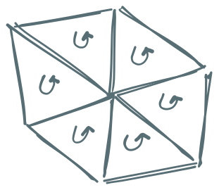
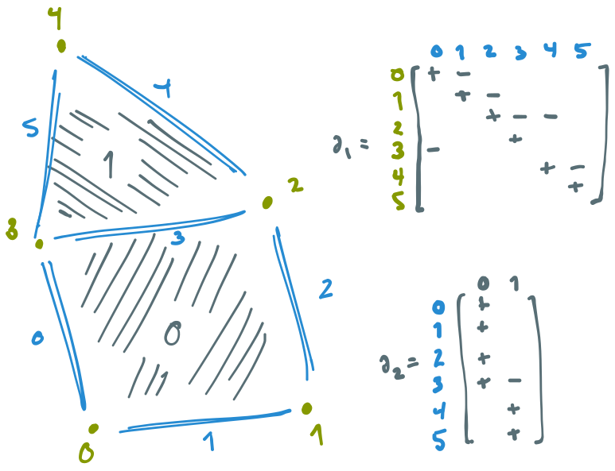
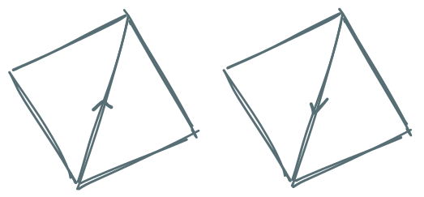
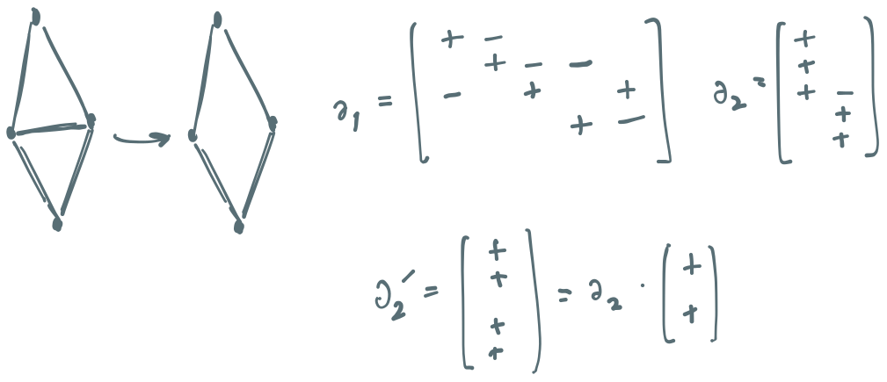
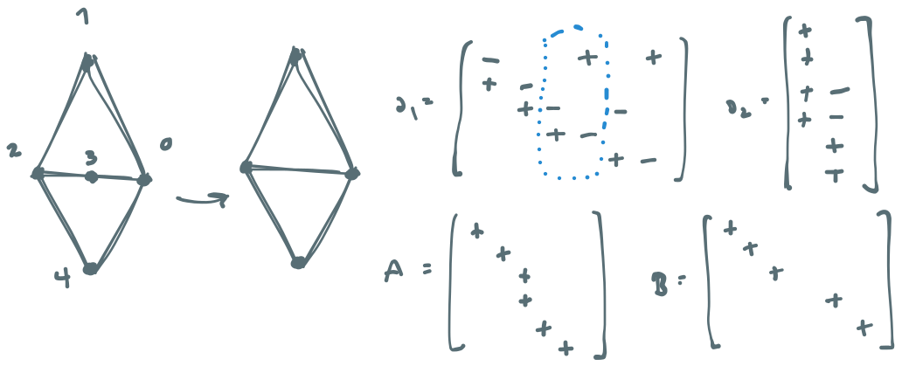
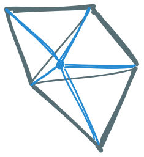
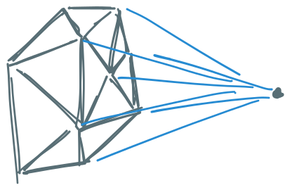
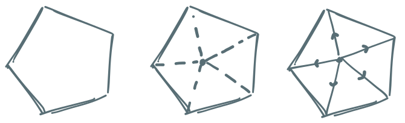
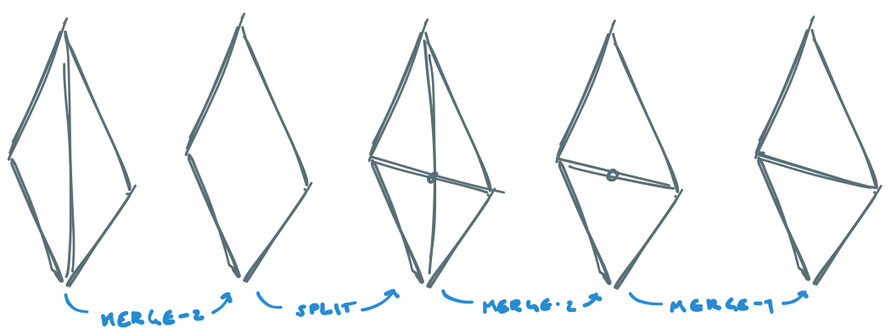
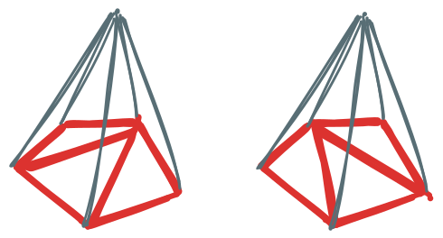

# Transforming chain complexes

Daniel Shapero

University of Washington

shapero@uw.edu

----

### Overview

* What are chain complexes
* Transforming chain complexes
* What next

---

# Chain complexes

----

### Mesh data structures



* Most common data type stores an array describing simplex $\rightarrow$ vertex adjacency.
* We need to order the rows to get orientation right.

----

### Mesh data structures

* Why seek an alternative?
  - loads of invariants $\Rightarrow$ transformation is hard
  - intermediate states might be non-simplicial
* Proposed alternative: **chain complexes**.

----

### Chain complexes

* A chain complex: a list $\\{\partial\_k\\}$ of sparse $\mathbb{Z}$ matrices.
* $\text{shape}(\partial\_k) = N\_{k - 1} \times N\_k$.
* The nonzero entries of a particular column of $\partial\_k$ = the faces of that $k$-cell.
* The signs of the entries describe the orientation.

----

### Example



----

$$\Huge{\partial\_k\cdot\partial\_{k + 1} = 0}$$

----

### Invariance

* Suppose that $\\{\partial\_k\\}$ is a chain complex and define
$$\begin{align}
\partial\_k' & = \partial\_k\cdot A, \\\\
\partial\_{k + 1}' & = B\cdot \partial\_{k + 1}
\end{align}$$
* Question: What will make $\partial\_k'\cdot\partial\_{k + 1}' = 0$?
* Answer: $\text{image}(\partial\_{k + 1})$ invariant under $A \cdot B$

----

### Examples

* Examples where $A \cdot B = I$:
  - $A$ = some sign flips; $B = A$
  - $A$ = permutation; $B$ = $A^*$

* Later we'll see more.

----

### A final conceit

* Add a *bottom* cell $\bot$ of dim -1; define $\partial v = \bot$.
* $\Rightarrow$ $\partial\_0 = \mathbf{1}^*$, where $\mathbf{1}$ is the column vector of all 1s.
* $\partial\_0\partial\_1 = 0$ implies that for every edge $e$,
$$e = v\_i - v\_j,$$
i.e. every edge goes from one vertex to another.


---

# Transformations

----

### Transformations

Idea: represent meshes as matrices $\Rightarrow$ we can use linear algebraic reasoning to transform them

----

### Merging

* Simplest transformation: *merge* two cells.
* In linear algebraic terms: add the corresponding columns of the matrix!
* Key transformation for surface simplification

----

### Example



----

### Example



----

### Splitting

* Harder problem: split a polytope along a vertex $v$.
* Key transformation for convex hulls + Delaunay.
 
* In 2D, we can do this by finding a counterclockwise ordering of the boundary.
This fails in 3D.

----

### Splitting

* A correct implementation has:
  - $v$ is in the closure of every new polytope
  - new boundary is the same as the old
* We can phrase this with linear algebra:
$$\partial\_n'\cdot\mathbf{1} = \left[\begin{matrix}\partial\_n\cdot\mathbf{1} \\\\ 0 \end{matrix}\right]$$

----

### The 2D case

* Signs are arbitrary; make every edge start at $v$.

* Linear algebra:
$$\partial\_1' = \left[\begin{matrix}\partial\_1 & I \\\\ 0 & -\mathbf{1}^*\end{matrix}\right]$$

----

### 2D splits

* But that was the easy part; what about $\partial\_2$?
Remember that the boundary might not be CCW!
* Useful fact: $\text{diag}(z)\cdot\mathbf{1} = z$.
* To preserve the old boundary, we can say that
$$\partial\_1' = \left[\begin{matrix}\partial\_1 & I \\\\ 0 & -\mathbf{1}^*\end{matrix}\right],\quad
\partial\_2' = \left[\begin{matrix}\text{diag}(\partial\_2\cdot\mathbf{1}) \\\\ ?\end{matrix}\right]$$

----

### 2D splits

* What we've got:
$$\partial\_1' = \left[\begin{matrix}\partial\_1 & I \\\\ 0 & -\mathbf{1}^*\end{matrix}\right],\quad
\partial\_2' = \left[\begin{matrix}\text{diag}(\partial\_2\cdot\mathbf{1}) \\\\ \mathbf{?}\end{matrix}\right]$$
* But $\partial\partial = 0$ lets us fill in the question mark:
$$\begin{align}
\partial\_1\cdot\text{diag}(\partial\_2\cdot\mathbf{1}) + I\cdot \mathbf{?} = 0 \\\\
\Rightarrow \mathbf{?} = -\partial\_1\cdot\text{diag}(\partial\_2\cdot\mathbf{1}).
\end{align}$$

----

### 2D splits

* Put it all together:
$$\partial\_1' = \left[\begin{matrix}\partial\_1 & I \\\\ 0 & -\mathbf{1}^*\end{matrix}\right],\quad
\partial\_2' = \left[\begin{matrix}\text{diag}(\partial\_2\cdot\mathbf{1}) \\\\ -\partial\_1\cdot\text{diag}(\partial\_2\cdot\mathbf{1})\end{matrix}\right]$$
* Remember the bottom cell?
$$\partial\_1' = \left[\begin{matrix}\partial\_1 & I \\\\ 0 & -\partial\_0\end{matrix}\right],\quad
\partial\_2' = \left[\begin{matrix}\text{diag}(\partial\_2\cdot\mathbf{1}) \\\\ -\partial\_1\cdot\text{diag}(\partial\_2\cdot\mathbf{1})\end{matrix}\right]$$

----

### nD splits

* For $k = 1, \ldots, n - 1$,
$$\partial\_k' = \left[\begin{matrix}\partial\_k & I \\\\ 0 & -\partial\_{k - 1}\end{matrix}\right]$$
* And for the top-dimensional cells,
$$\partial\_n' = \left[\begin{matrix}\text{diag}(\partial\_n\cdot\mathbf{1}) \\\\ -\partial\_{n - 1}\cdot\text{diag}(\partial\_n\cdot\mathbf{1})\end{matrix}\right].$$

----

### Implementation

```python
def split(D: List[np.ndarray]) -> List[np.ndarray]:
    n_vertices = D[0].shape[1]
    E = [np.ones((1, n_vertices + 1), int)]
    for k in range(1, len(D) - 1):
        n_cells = D[k].shape[1]
        n_sub_faces, n_faces = D[k - 1].shape
        I = np.identity(n_faces, int)
        Z = np.zeros((n_sub_faces, n_cells), int)
        E_k = np.block([[D[k], I], [Z, -D[k - 1]]])
        E.append(E_k)

    C = np.diag(np.sum(D[-1], axis=1))
    E_n = np.vstack((C, -D[-2] @ C))
    E.append(E_n)
    return E
```

----

### Demonstration

[github.com/TopoMesh/zmsh](https://github.com/TopoMesh/zmsh)


---

# Conclusions

----

### Costs

* Transforming chain complexes = linear algebra.
* Chain complexes are more expensive to store.
* But simplicial $\Leftrightarrow$ chain complex representation is easy to compute, so we can just do it locally.

----

### Classic transformations

We can do edge-flips in 2D and face flips in 3D as a sequence of splits and merges.



----

### What next

Can we do multi-cell transformations?



Can we do even more complex things?

----

### Acknowledgements

Helpful discussions with Matt Knepley, Tobin Isaac, Leila de Floriani, and Mauricio del Razo.

----


